平台的主要功能模块包括：  

1）图像处理模块：提供基础的图像预处理功能；  

2）图像理解模块：实现高级语义分析；  

3）模型解释模块：可视化模型决策过程；  

4）轨迹生成模块：用于运动目标分析；  

5）目标追踪模块：实现连续帧目标跟踪；  

6）SAM（Segment Anything Model）模块：先进的零样本分割功能；  

7）OBB（Oriented Bounding Box）检测模块：支持旋转目标检测；  

8）解决方案模块：提供特定场景的定制化方案。平台采用模块化架构，各功能模块既可独立运行，也能协同工作，通过右侧的参数配置面板，用户可以灵活调整推理参数，如置信度阈值等，以获得最佳的分析结果。  

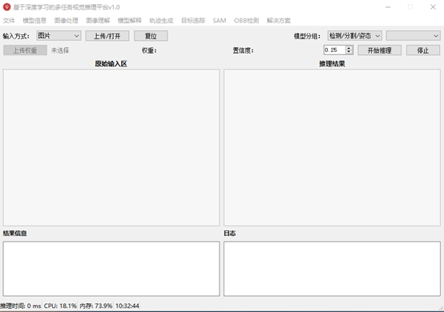

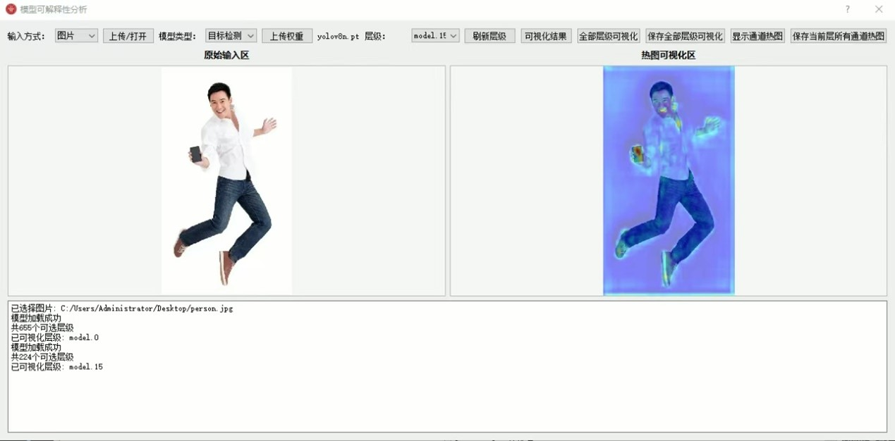

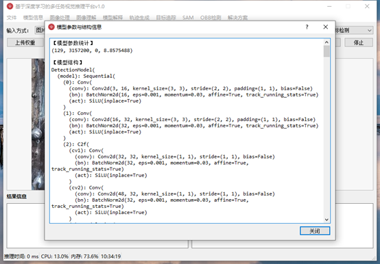

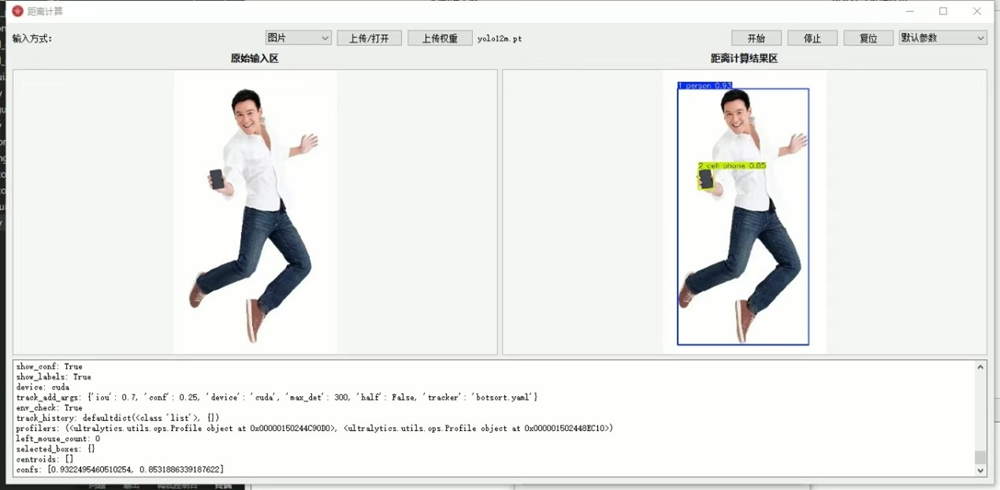

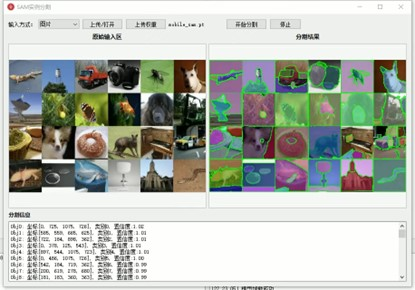

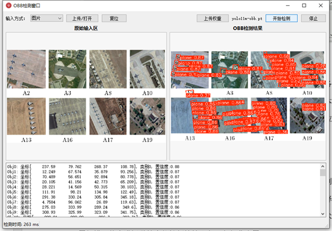

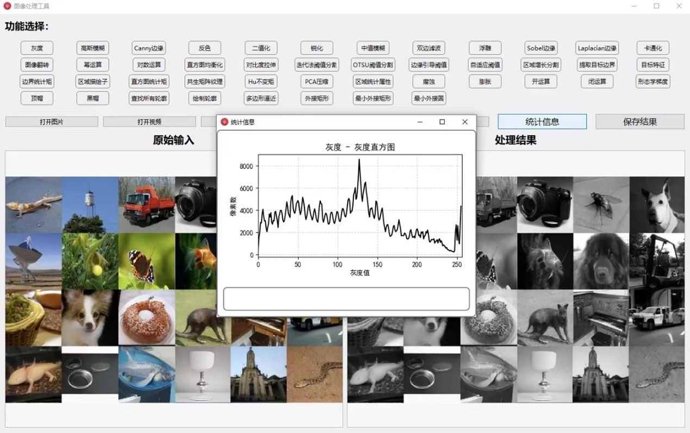

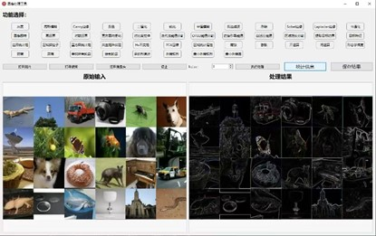

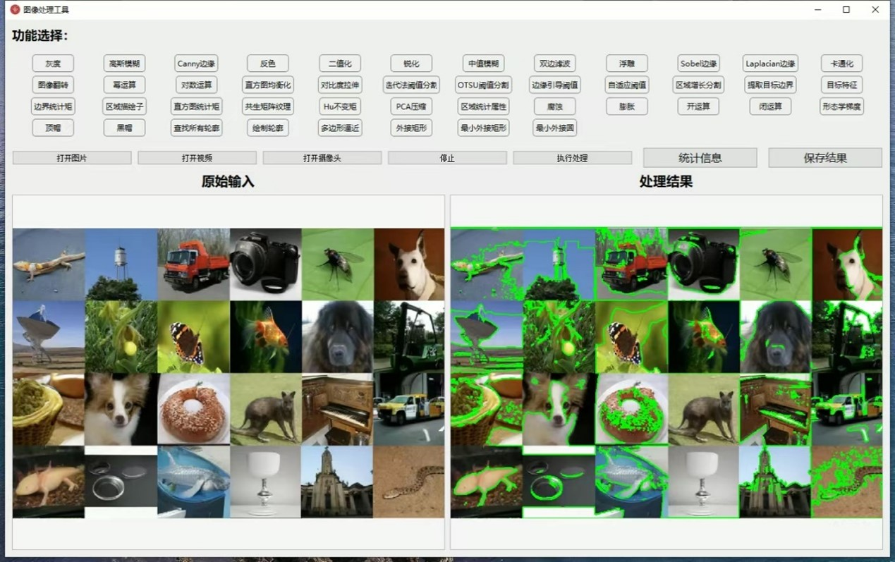

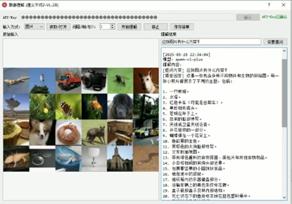

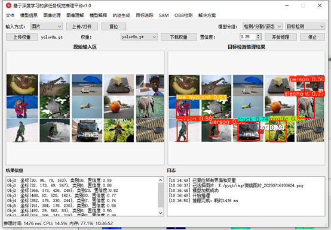

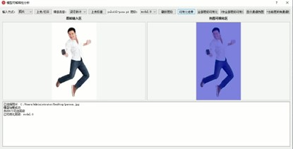
